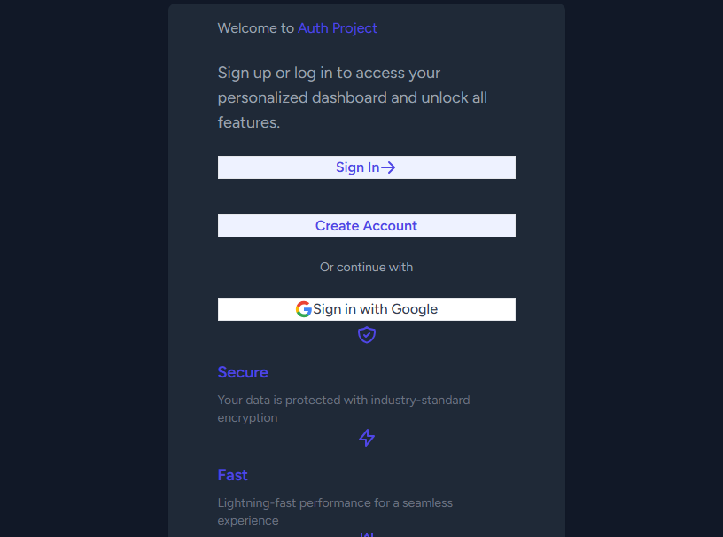
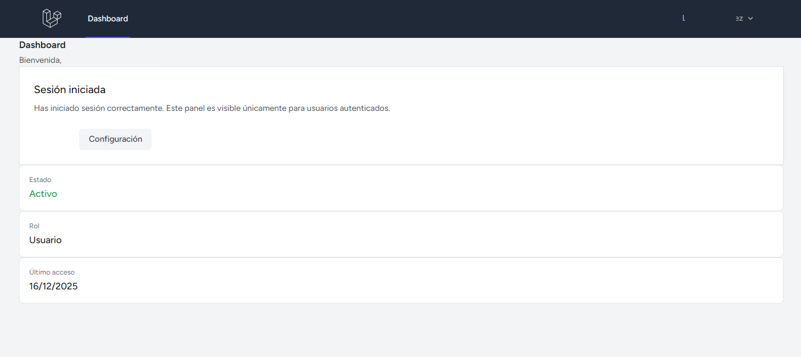

<p align="center"><a href="https://laravel.com" target="_blank"></a></p>

<p align="center">
<a href="https://github.com/laravel/framework/actions"></a>
<a href="https://packagist.org/packages/laravel/framework"></a>
<a href="https://packagist.org/packages/laravel/framework"></a>
<a href="https://packagist.org/packages/laravel/framework"></a>
</p>

# Auth Project

El proyecto es una aplicación web construida con Laravel, que integra un sistema completo de autenticación utilizando Laravel Breeze para el manejo de usuarios mediante correo electrónico y contraseña, así como autenticación con Google mediante OAuth.

Incluye un dashboard personalizado, accesible únicamente para usuarios autenticados, y una página de bienvenida personalizada para usuarios no registrados, reemplazando el contenido original de welcome.blade.php.

El diseño de la interfaz fue desarrollado con Tailwind CSS, priorizando una experiencia de usuario moderna, responsiva y clara.

---

## Características principales

-   Registro de usuarios
-   Inicio de sesión seguro
-   Autenticación con Google
-   Diseño moderno con Tailwind CSS
-   Modo oscuro
-   Interfaz responsiva

---

## Tecnologías utilizadas

-   **Laravel** — Framework backend
-   **Blade** — Motor de plantillas
-   **Tailwind CSS** — Estilos y diseño UI
-   **Vite** — Compilación de assets
-   **MySQL** — Base de datos
-   **Laravel Breeze / Auth** — Autenticación
-   **Google OAuth** — Login social

---

## Estructura del proyecto

```bash
auth-project/
├── app/
├── resources/
│   ├── views/
│   │   ├── auth/
│   │   └── layouts/
│   ├── css/
│   └── js/
├── routes/
│   └── web.php
├── public/
└── README.md
```

## Ejemplo

<p align="center">
  
</p>

<p align="center">
  
</p>

## Licencia

Este proyecto está bajo la licencia MIT
